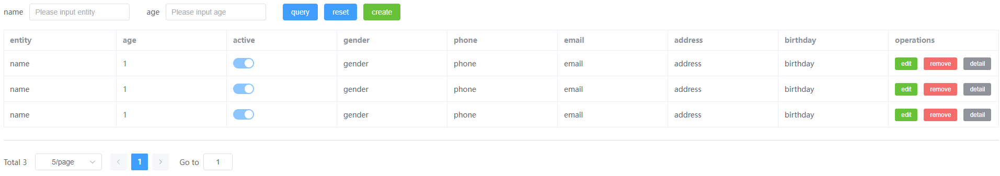
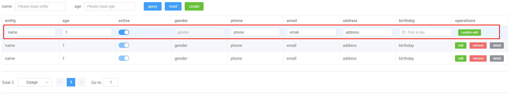
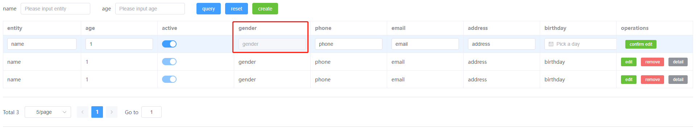
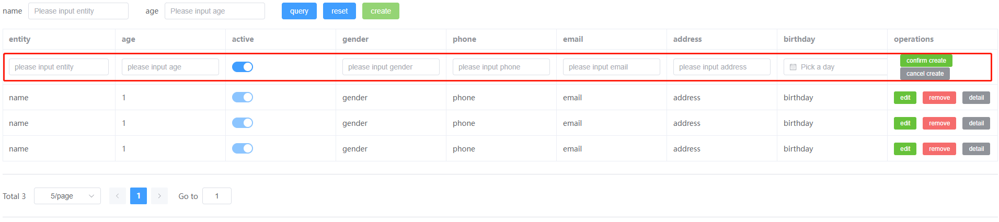

# create-crud-template
This cli is used for creating CRUD template of various UI libraries, emelent-plus, ant-design, vant and so on.  
The Main Purpose is to free developers from manually creating entity CRUD files.

## instruction
Until now, webcrud-cli only support element-plus CRUD template, other template will be available later.

# How to use?
## install globally
### 1. install
```cmd
npm install webcrud-cli -g
```

### 2. initialize
Instruction: User should run the following commands in the target working directory. For example, in vue project there's a folder named "views". if user want to create a user entity in views folder. And the commonand shall run in this "views" folder.

```cmd
webcrud-cli init <entity>
```
1. This command will create a file named [entity].config.cjs in the current working directory.
2. Modify the name of [entity].config.cjs to assign a customized name for entity, like assets.config.cjs or products.config.cjs
3. Modify the config file to make costumized entity configuration. Instructions on options move to "config.cjs" section.

### 3. create

The following command will create crud template.
```cmd
webcrud-cli create
```
If there is only one entity.config.cjs file in current working directory, the cli will immediately create crud template according to this file. However, if there are multiple config.cjs files, the command line will show an interface for user to select the list.

After user select one item, the cli will create a folder named 'entity' then emit template files into it.

# config.cjs
\<entity\>.config.cjs structure is as following:
```js
const path = require('path');

const config = {
  type: 'element-plus', // UI type: currently only support element-plus
  output: path.resolve(__dirname), // output, current working directoy
  editable: true, // entity table editable or not
  hasPagination: true, // whether need pagination or not
  fields: { // entity properties, is an object
    name: {
      prop: String, // value type of property
      type: "input", // specify element to show the property value , currently support input, datepicker
      label: "entity", // the label of property, used in table header
      required: true, // whether this property is required
      editable: true, // INSTRUCTION: if you are editing a row, editable will control this field is editable or not.
      query: true, // INSTRUCTION: whether this property is quariable, if you set query as true, it will appear in the search bar.
    },
    age: {
      prop: Number,
      type: "input",
      label: "age",
      required: true,
      editable: true,
      query: true,
    },
    active: {
      prop: Boolean,
      type: "switch",
      label: "active",
      required: false,
      editable: true,
      query: false,
    },
    gender: {
      prop: String,
      type: "input",
      label: "gender",
      required: true,
      editable: false,
      query: false,
    },
    phone: {
      prop: String,
      type: "input",
      label: "phone",
      required: true,
      editable: true,
      query: false,
    },
    email: {
      prop: String,
      type: "input",
      label: "email",
      required: false,
      editable: true,
      query: false,
    },
    address: {
      prop: String,
      type: "input",
      label: "address",
      required: false,
      editable: true,
      query: false,
    },
    birthday: {
      prop: String,
      type: "datepicker",
      label: "birthday",
      required: false,
      editable: true,
      query: false,
    },
  },
  // operations: ["create", "update", "remove", "detail"],
  // dependencies: [
  //   {
  //     name: "store",
  //     isNeed: true,
  //     path: "@/stores",
  //     aliasName: "userStore",
  //     actionTypes: {
  //       isNeed: true,
  //       path: "@/stores/action-types",
  //     },
  //   },
  //   {
  //     name: "router",
  //     isNeed: true,
  //   },
  // ],
};
module.exports = config;

```

## examples
entity view


edit mode


ineditable field


create a new row


## code for users to edit
in crud.ts
```ts
// user can replace the api request. place that need to modify is marked as comment of [USER EDIT]
export const getEntitys = async (params: IEntityQuery): Promise<any> => {
    try {
        // [USER EDIT]
        return MockData;
    } catch (e) {
        console.log(e);
        return e
    }
}
export const create = async(entity: IEntity): Promise<any> => {
    // filter unnecessay properties in entity
    let _entity = filterFields(entity, Fields);
    try {
      // [USER EDIT]
        // update api (user defined)
        // const res = await createEntity(_entity)
        // return res
    }
    catch (err) {
        return err
    }
}

export const update = async(entity: IEntity): Promise<any> => {
    // filter unnecessay properties in entity
    let _entity = filterFields(entity, Fields);
    try {
      // [USER EDIT]
        // update api (user defined)
        // const res = await updateEntity(_entity)
        // return res
    }
    catch (err) {
        return err
    }
}
export const remove = async (id: string): Promise<any> => {
    try {
        // remove api (user defined)
        // const res = await updateEntity(id)
        // return res
    }
    catch (err) {
        return err
    }
}
```